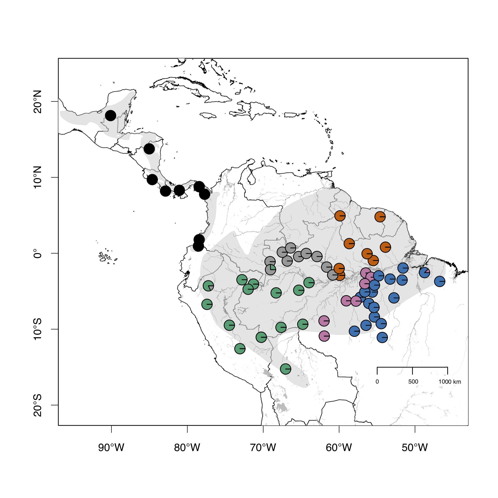

# Plot Ancestral Coefficient Maps
> A R script to make beautiful maps with piecharts of ancestral coefficient outputs from genetic population structure analyses such as SNMf and STRUCTURE

## Purpose:
Genetic population structure programs usually provide results in side by side bar plots which are somewhat nice, but sometimes hard to visualize in a spatial context. This script will plot your ancestral coefficients as piecharts using a colorblin friendly pallete in a beautiful map. This will give you a better idea of the geographic distribution of your genetic structure. 

* You will end up with something like this:

## What do you need:

* An ancestral coefficient matrix in the format presented in anc_coef/snmf_1round.csv file

* A geographic coordinate in decimal form of each sample in the same order as ancestral coeffiecient matrix

* The shapefiles of the geographic features you want to show: continents, rivers, distribution, etc...

* You need to have R installed and the following packages
    * maps
    * plotrix
    * mapdata
    * sp
    * raster
    * rgdal

## Source:

The original data comes from a previous publication of mine where I used this script and it is accessible here:

*Buainain, N., Maximiano, M. F. A., Ferreira, M., Aleixo, A., Faircloth, B. C., Brumfield, R. T., . . . Ribas, C. C. (2021). Multiple species and deep genomic divergences despite little phenotypic differentiation in an ancient Neotropical songbird, Tunchiornis ochraceiceps (Sclater, 1860) (Aves: Vireonidae). Molecular Phylogenetics and Evolution, 162, 107206.* <https://doi.org/10.1016/j.ympev.2021.107206>

